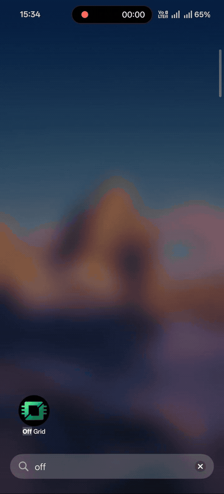
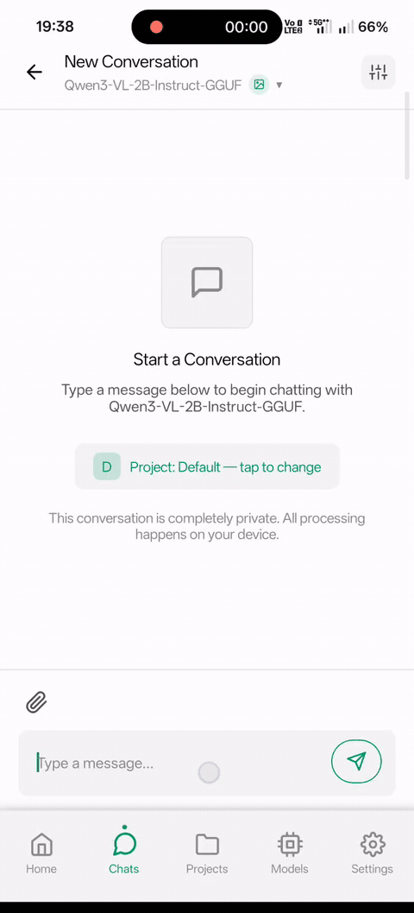

<div align="center">


# Off Grid

### The Swiss Army Knife of On-Device AI

**Chat. Generate images. See. Listen. All on your phone. All offline. Zero data leaves your device.**

[](https://github.com/alichherawalla/offgrid-mobile)
[](LICENSE)
[](#install)

</div>

---

## Not just another chat app

Most "local LLM" apps give you a text chatbot and call it a day. Off Grid is a **complete offline AI suite** — text generation, image generation, vision AI, voice transcription, and document analysis, all running natively on your phone's hardware.

---

## What can it do?

<div align="center">
<table>
<tr>
<td align="center"><br /><b>Onboarding</b></td>
<td align="center"><br /><b>Text Generation</b></td>
<td align="center"><br /><b>Image Generation</b></td>
<td align="center"><br /><b>Vision AI</b></td>
<td align="center"><br /><b>Attachments</b></td>
</tr>
</table>
</div>

**Text Generation** — Run Qwen 3, Llama 3.2, Gemma 3, Phi-4, and any GGUF model. Streaming responses, thinking mode, 15-30 tok/s on flagship devices. Bring your own `.gguf` files too.

**Image Generation** — On-device Stable Diffusion with real-time preview. NPU-accelerated on Snapdragon (5-10s per image), Core ML on iOS. 20+ models including Absolute Reality, DreamShaper, Anything V5.

**Vision AI** — Point your camera at anything and ask questions. SmolVLM, Qwen3-VL, Gemma 3n — analyze documents, describe scenes, read receipts. ~7s on flagship devices.

**Voice Input** — On-device Whisper speech-to-text. Hold to record, auto-transcribe. No audio ever leaves your phone.

**Document Analysis** — Attach PDFs, code files, CSVs, and more to your conversations. Native PDF text extraction on both platforms.

**AI Prompt Enhancement** — Simple prompt in, detailed Stable Diffusion prompt out. Your text model automatically enhances image generation prompts.

---

## How it compares

|  | **Off Grid** | PocketPal | Other local LLM apps |
|---|:---:|:---:|:---:|
| Text Chat (GGUF) | **Yes** | Yes | Yes |
| Image Generation | **On-device SD** | No | No |
| Vision AI | **Yes** | No | Rare |
| Voice Transcription | **On-device Whisper** | No | No |
| Document/PDF Attach | **Yes** | No | No |
| GPU/NPU Acceleration | **OpenCL + QNN + Metal + ANE** | Limited | Varies |
| Bring Your Own Model | **Yes** | Yes | Sometimes |
| AI Prompt Enhancement | **Yes** | No | No |
| Message Queue | **Yes** | No | No |
| Background Generation | **Yes** | No | No |
| OOM Prevention | **Yes** | No | No |
| Dark Mode | **Yes** | Yes | Varies |
| Open Source | **MIT** | Apache 2.0 | Varies |

---

## Performance

| Task | Flagship | Mid-range |
|------|----------|-----------|
| Text generation | 15-30 tok/s | 5-15 tok/s |
| Image gen (NPU) | 5-10s | — |
| Image gen (CPU) | ~15s | ~30s |
| Vision inference | ~7s | ~15s |
| Voice transcription | Real-time | Real-time |

Tested on Snapdragon 8 Gen 2/3, Apple A17 Pro. Results vary by model size and quantization.

---

<a name="install"></a>
## Install

### Android — Download APK

Grab the latest APK from [**GitHub Releases**](https://github.com/alichherawalla/offgrid-mobile/releases/latest), install, and start chatting in under 2 minutes.

### Build from source

```bash
git clone https://github.com/alichherawalla/offgrid-mobile.git
cd OffgridMobile
npm install

# Android
cd android && ./gradlew clean && cd ..
npm run android

# iOS
cd ios && pod install && cd ..
npm run ios
```

> Requires Node.js 20+, JDK 17 / Android SDK 34 (Android), Xcode 15+ (iOS). See [full build guide](docs/ARCHITECTURE.md#building-from-source).

---

## Documentation

| Document | Description |
|----------|-------------|
| [Architecture & Technical Reference](docs/ARCHITECTURE.md) | System architecture, design patterns, native modules, performance tuning |
| [Codebase Guide](docs/CODEBASE_GUIDE.md) | Comprehensive code walkthrough |
| [Design System](docs/DESIGN_PHILOSOPHY_SYSTEM.md) | Brutalist design philosophy, theme system, tokens |

---

## Contributing

Contributions welcome! Fork, branch, PR. See [development guidelines](docs/ARCHITECTURE.md#contributing) for code style and patterns.

---

## Acknowledgments

Built on the shoulders of giants:
[llama.cpp](https://github.com/ggerganov/llama.cpp) | [whisper.cpp](https://github.com/ggerganov/whisper.cpp) | [llama.rn](https://github.com/mybigday/llama.rn) | [whisper.rn](https://github.com/mybigday/whisper.rn) | [local-dream](https://github.com/nicenemo/local-dream) | [ml-stable-diffusion](https://github.com/apple/ml-stable-diffusion) | [MNN](https://github.com/alibaba/MNN) | [Hugging Face](https://huggingface.co)

---

<div align="center">

**Off Grid** — Your AI, your device, your data.

*No cloud. No subscription. No data harvesting. Just AI that works anywhere.*

</div>
